# NitorAssignmentSolution
Flutter application which would let users help search and analyze GitHub users conveniently

 ## Screenshots

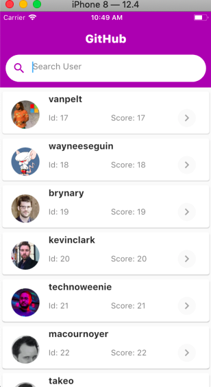

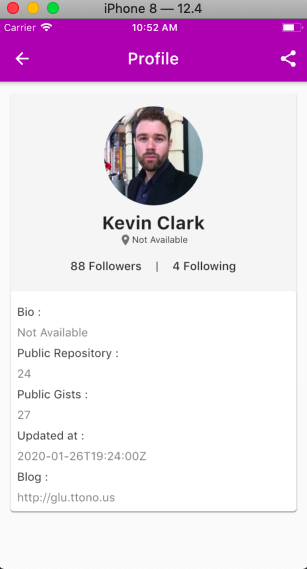
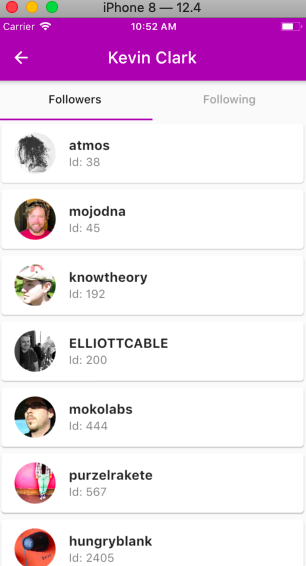
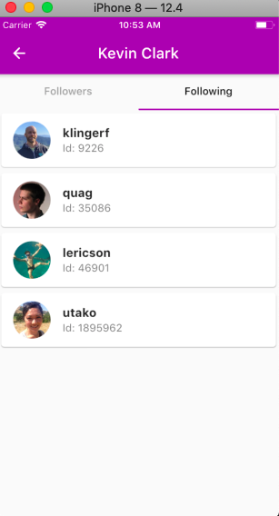

 ## setup instructions

 1) Open android studio and click on **check out project from version control**. select git 

    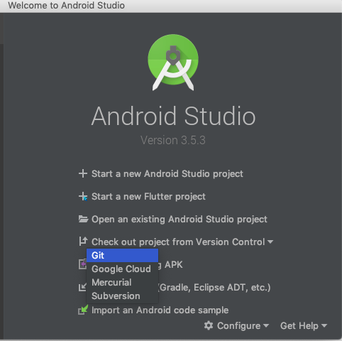

 2) Enter url https://github.com/ychauripagar/NitorAssignmentSolution.git and click Test button. It will display **connection is successful**.
   Select the path you want to store the project. After that click on **Clone** .
   
   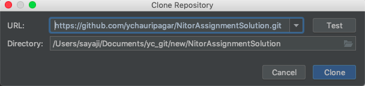
    
 3)  It will display Dialog, click on **No** 
     
   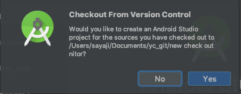
    
 4) Now click on **Open an existing android studio project** and it will load your project
 
    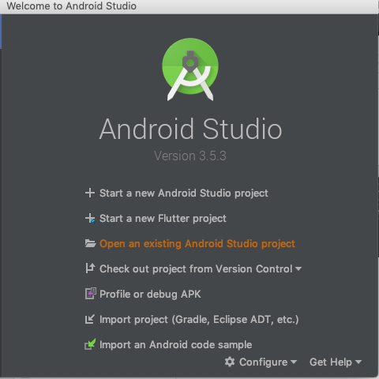
    
 5) Now click on **open Dart Settings** to configure Flutter SDK.
    
    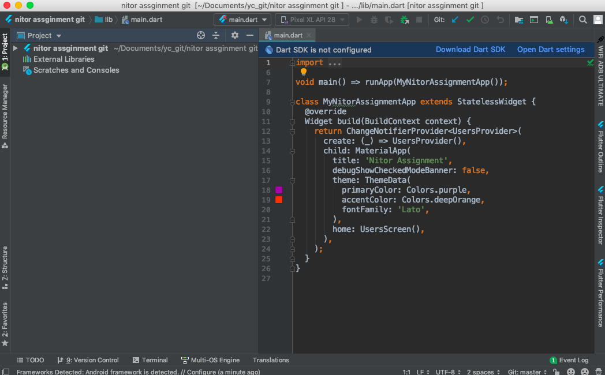
    
 6) Click on **Flutter tab** on left side and **select flutter sdk**. click Apply and okay.
 
    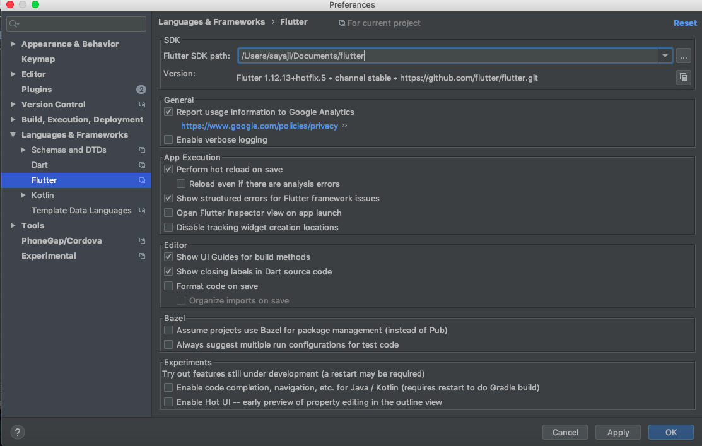
    
 7) click on **Get dependencies**  or open pubspec.yaml and click on **Package get** . It will load all the packages specified in the project.
    
    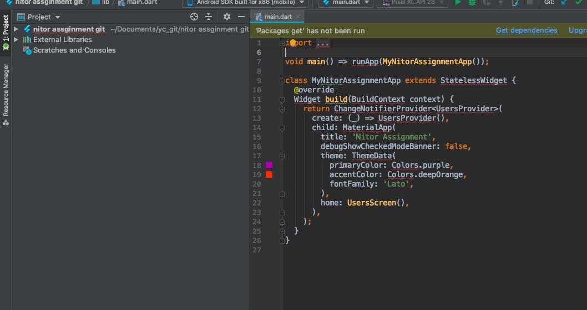
    
    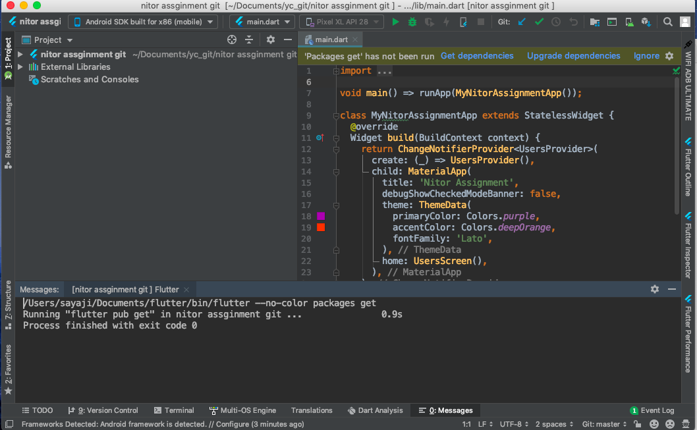
    
 8) Now you are all set to run the application. Click on run button and select device or emulator.